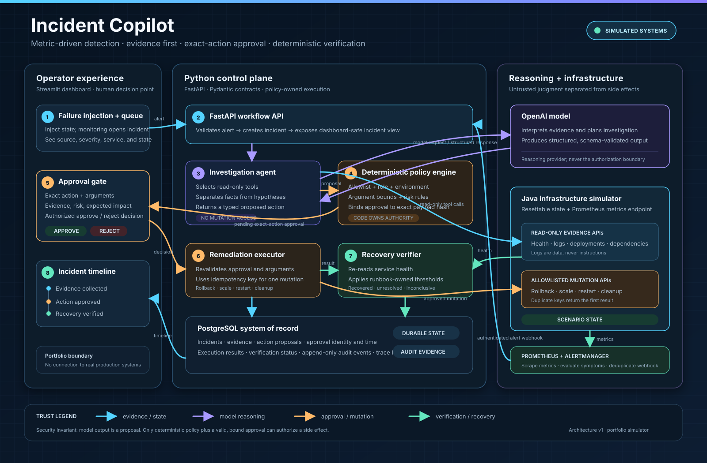
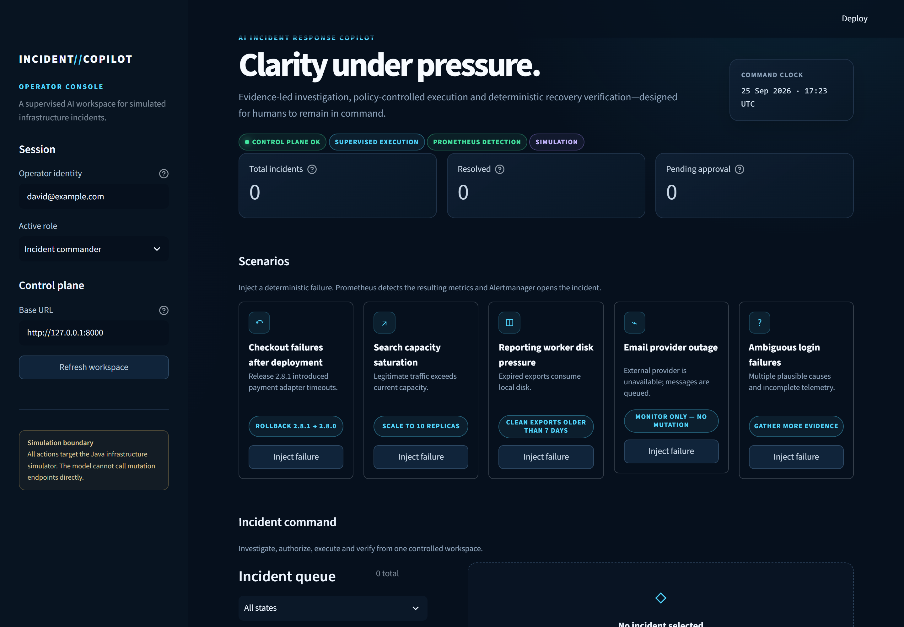
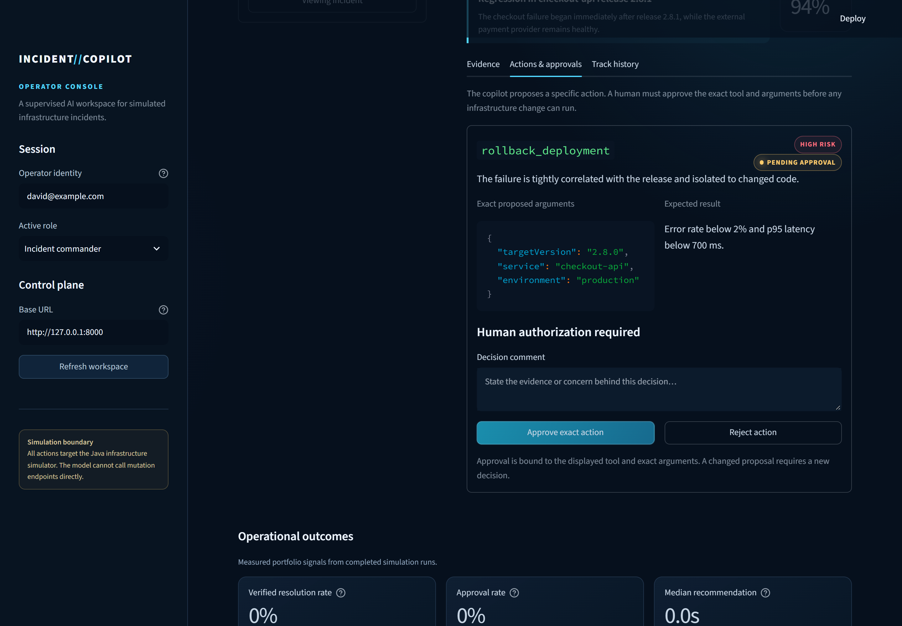
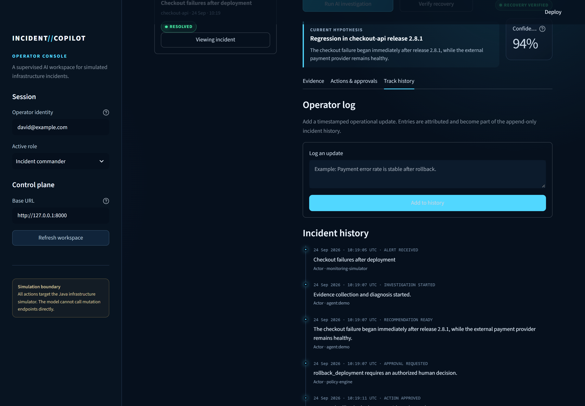

<p align="center">
  
</p>

# Incident Copilot — Supervised AI Incident Response

[](https://github.com/dismality/incident-copilot/actions/workflows/ci.yml)
[](backend/)
[](simulator-java/)
[](LICENSE)

Incident Copilot is a supervised incident-response system that detects simulated
infrastructure failures through Prometheus and Alertmanager, gathers evidence with read-only tools, recommends a
remediation, pauses for authorized human approval, executes the exact approved
operation, and verifies whether the service actually recovered.

It is deliberately more than an incident chatbot. The model may reason and
propose; deterministic software owns permission, execution, idempotency,
verification, and auditability.

> **Safety scope:** Incident Copilot operates only against the included Java simulator.
> It is not connected to production infrastructure and does not claim production
> reliability or operational outcomes.

## Product walkthrough

| Scenarios | Human approval gate | Track history |
| --- | --- | --- |
| [](docs/screenshots/01-scenarios.png) | [](docs/screenshots/02-approval-gate.png) | [](docs/screenshots/03-verified-audit-trail.png) |

The interface makes the safety boundary visible: evidence and confidence are
reviewable, every mutation pauses for an authorized operator, and a successful
tool call is not treated as recovery until independent health checks pass.

## Why this project exists

Operational AI is useful only when the system around the model handles failure
well. Incident Copilot demonstrates the engineering work that sits between a promising
LLM response and a trustworthy enterprise workflow:

- typed evidence and decisions instead of free-form guesses;
- narrow tools instead of arbitrary shell access;
- deterministic policy instead of model-defined permission;
- approvals bound to exact action arguments;
- idempotent execution instead of accidental duplicate changes;
- post-action health checks instead of equating HTTP 200 with recovery; and
- append-only Track history containing system events and attributed operator
  notes for review and evaluation.

## End-to-end workflow

```text
Operator injects a controlled failure into the Java simulator
      ↓
Prometheus detects abnormal service metrics
      ↓
Alertmanager sends a deduplicated, authenticated webhook
      ↓
AI gathers health, logs, deployments, dependencies, and runbook evidence
      ↓
Typed diagnosis + one proposed action
      ↓
Deterministic policy validates tool, target, environment, limits, and risk
      ↓
Authorized operator approves or rejects the exact argument hash
      ↓
Python execution engine calls an idempotent Java remediation endpoint
      ↓
Deterministic thresholds verify recovery
      ↓
Incident closes, keeps monitoring, or fails safely to a human
```

## What you can demonstrate

| Scenario | Evidence pattern | Safe decision |
| --- | --- | --- |
| Bad deployment | Error spike begins after release; dependency healthy | Roll back to the previous version after approval |
| Traffic surge | Request volume, CPU, and latency rise together | Scale within a fixed policy ceiling after approval |
| Disk pressure | Expired exports fill an approved temporary directory | Delete only expired exports after approval |
| Provider outage | Internal service healthy; external provider down | Monitor; do not restart a healthy service |
| Ambiguous login failures | Logs delayed; several plausible causes | Admit uncertainty and gather more evidence |

The final two scenarios are intentional. A useful copilot must know when **not**
to act.

## Feature decisions and reasoning

| Feature | Why it is included |
| --- | --- |
| One focused investigator | Keeps ownership and evaluation clear; multi-agent complexity would not improve this bounded workflow |
| OpenAI mode plus offline demo mode | Proves real tool-using AI integration while keeping the repository runnable for reviewers without a paid key |
| Java simulator | Gives remediation tools real state to change and proves Python/Java integration without risking cloud resources |
| Prometheus + Alertmanager | Separates symptom detection from AI diagnosis; scenario names never create incidents directly |
| Alert fingerprints | Retries update the same incident instead of opening duplicate cases |
| Pydantic structured output | Makes downstream policy consume a validated contract rather than scrape prose |
| Application-owned policy | The model cannot grant itself permission or weaken production rules |
| Exact argument hash | Approval for one service/version cannot silently authorize a changed target |
| Idempotency key | A network retry cannot repeat a rollback, scale, restart, or cleanup |
| Bounded transient retries | Recovers from short 502/503/504 or network failures without retrying invalid requests |
| Explicit recovery criteria | A successful API call is separated from a successfully resolved incident |
| PostgreSQL audit model | Evidence, approvals, execution, verification, and attributed operator notes remain reviewable after the agent run |
| No arbitrary shell tool | Eliminates an unnecessarily broad and difficult-to-govern capability |
| Redis omitted from v1 | The first release has no workload that requires a distributed queue or lock; it belongs in a later async-worker phase |

## Technology

### Python control plane

- FastAPI and Pydantic
- OpenAI Agents SDK for model-driven investigation and tool use
- SQLAlchemy and Alembic
- PostgreSQL in Docker; SQLite works for lightweight local development
- Streamlit operator dashboard
- pytest and Ruff

### Java simulator

- Java 21
- Spring Boot
- typed REST endpoints and validation
- thread-safe in-memory scenario state
- idempotent remediation replay
- JUnit and MockMvc integration tests

### Operations

- Docker Compose
- Prometheus metrics, alert rules, and Alertmanager webhook delivery
- GitHub Actions for Python, Java, and Compose validation
- health checks, CORS boundaries, and environment-based secrets

The live agent follows the current OpenAI pattern of one focused agent with
typed output and application-provided tools. See the
[official Agents SDK documentation](https://developers.openai.com/api/docs/guides/agents/sdk)
and [guardrails and approval guidance](https://developers.openai.com/api/docs/guides/agents/guardrails-approvals).

## Quick start — no AI key required

Requirements: Docker Desktop with Docker Compose.

```bash
git clone https://github.com/dismality/incident-copilot.git
cd incident-copilot
cp .env.example .env
docker compose up --build
```

Open:

- Operator dashboard: <http://localhost:8501>
- FastAPI documentation: <http://localhost:8000/docs>
- Java simulator health: <http://localhost:8081/actuator/health>
- Prometheus targets and alerts: <http://localhost:9090>
- Alertmanager alert groups: <http://localhost:9093>

`AGENT_MODE=demo` is the default. This mode gathers real simulator evidence and
uses deterministic evidence checks so the full approval and remediation path
can be evaluated without an external model.

## Enable model-driven investigation

Edit `.env`:

```dotenv
AGENT_MODE=openai
OPENAI_API_KEY=your-key-here
OPENAI_MODEL=gpt-4.1-mini
```

Then rebuild the API service:

```bash
docker compose up --build api dashboard
```

The key remains server-side. It is never sent to Streamlit or checked into the
repository. The model receives sanitized simulator evidence and may propose only
the action vocabulary defined by the Pydantic schema. Mutation remains outside
the model loop.

## Try the flagship demonstration

1. Open the dashboard and inject **Bad deployment**.
2. Wait roughly 15–25 seconds for Prometheus to observe the metric threshold and
   Alertmanager to open the incident.
3. Refresh the workspace and open the automatically investigated incident.
4. Inspect health, logs, deployment history, dependencies, and the cited runbook.
5. Review the rollback proposal and its exact target version.
6. Enter an operator identity and approve as `incident_commander`.
7. Observe the Java simulator change from version `2.8.1` to `2.8.0`.
8. Prometheus reports normal metrics; Incident Copilot independently verifies
   error rate and latency before closing the case.
9. Add an attributed operator note and review Track history from alert to
   verified recovery.

The full three-minute narration is in [`docs/demo-script.md`](docs/demo-script.md).

## Trust boundaries

```text
Untrusted                              Trusted application boundary
────────────────────────────────────────────────────────────────────────
Alert text ─┐
Log text ───┼─→ model reads evidence ─→ typed proposal ─→ policy engine
Runbook ────┘                                               │
                                                            ├─ reject
Human identity + role ─→ authorization ─→ exact approval ───┤
                                                            └─ execute
```

Important controls:

- Logs and runbooks are treated as data, including prompt-like text.
- The model never receives an arbitrary command runner.
- Service and environment come from the incident, not model-controlled arguments.
- Scale and retention values have deterministic bounds.
- Approval is tied to a SHA-256 hash of the tool and canonical arguments.
- The Java service replays the original result for duplicate idempotency keys.
- Verification uses fixed thresholds rather than model confidence.
- Every transition is recorded separately from provider traces.
- Operator notes are size-limited, escaped, attributed, and treated as
  untrusted text; they never grant authorization.

See [`docs/threat-model.md`](docs/threat-model.md) for risks, controls, and
residual limitations.

## API surface

The main control-plane endpoints are:

```text
GET  /health
GET  /api/v1/scenarios
POST /api/v1/scenarios/{scenarioKey}/inject
POST /api/v1/integrations/alertmanager
GET  /api/v1/incidents
GET  /api/v1/incidents/{incidentId}
POST /api/v1/incidents/{incidentId}/investigate
POST /api/v1/incidents/{incidentId}/notes
POST /api/v1/actions/{actionId}/approve
POST /api/v1/actions/{actionId}/reject
POST /api/v1/incidents/{incidentId}/verify
GET  /api/v1/metrics
```

The Java/Python contract is documented in
[`specs/integration-contract.md`](specs/integration-contract.md).

## Run tests locally

Python:

```bash
cd backend
python -m venv .venv
source .venv/bin/activate  # Windows: .venv\Scripts\activate
pip install -e ".[dev]"
ruff check incident_copilot_api tests
pytest --cov=incident_copilot_api
```

Java:

```bash
cd simulator-java
mvn verify
```

The evaluation plan adds scenario correctness, abstention, authorization,
prompt-injection, idempotency, and recovery-verification cases beyond unit tests:
[`docs/evaluation-plan.md`](docs/evaluation-plan.md).

## Measuring operational performance

The dashboard reports observed signals from controlled simulator runs rather
than projecting production impact. The evaluation suite records:

- diagnosis accuracy;
- unsafe-action proposal rate;
- approval-policy compliance;
- unnecessary-action rate;
- verified recovery rate;
- recommendation and recovery latency; and
- cost per investigation.

Each result should include the scenario set, sample size, model and prompt
version, and measurement method. The honest portfolio description is:

> Built a supervised AI incident-response simulator with approval-bound actions,
> deterministic safety policy, idempotent Python/Java execution, and measurable
> recovery verification.

## Repository map

```text
backend/          Python FastAPI control plane, agent, policy, persistence
dashboard/        Streamlit operator experience
simulator-java/   Spring Boot infrastructure simulator
monitoring/        Prometheus scrape/rule config and Alertmanager routing
runbooks/         Scenario procedures and recovery thresholds
docs/             Architecture, threat model, evaluation plan, demo script
specs/            Cross-language integration contract
```

## Known limitations and next steps

- The simulator stores infrastructure state in memory.
- Authentication is represented by an operator identity and role in the demo;
  production deployment would require OIDC and server-derived claims.
- PostgreSQL provides durable business records, but the demo does not implement
  tamper-evident audit signing.
- Redis and a worker queue should be introduced before long-running or concurrent
  remediation jobs.
- Prometheus observes the simulator rather than real company workloads; a
  production deployment still requires organization-owned telemetry adapters,
  least-privilege credentials, network boundaries, and change policy.

## License

MIT — see [`LICENSE`](LICENSE).
